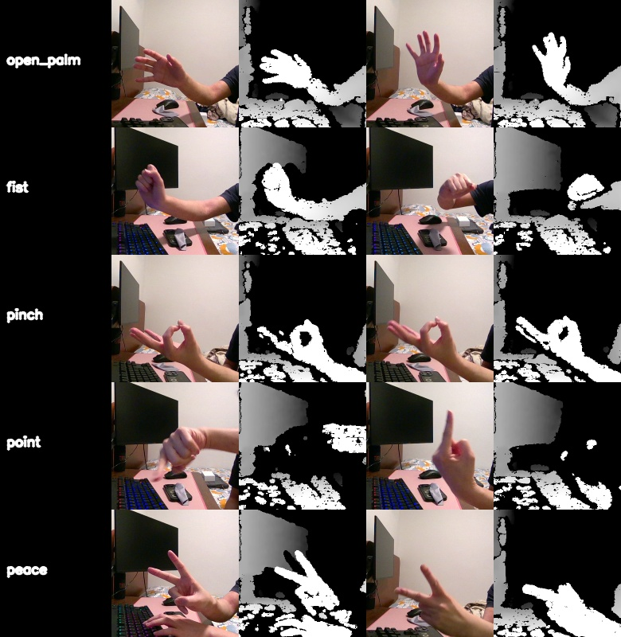

# D455F Applied RGB-D Intelligence Lab

A portfolio-oriented RGB-D computer vision project using the Intel RealSense D455F.

The project focuses on practical RGB-D perception workflows:

- RGB / depth preview
- center ROI crop
- depth quality metadata
- hand gesture dataset collection
- RGB-D dataset auditing
- point cloud capture and object measurement
- future classifier training and robotics perception demos

## Current Status

### Scanner / Point Cloud Pipeline

Implemented:

- D455F camera preset
- local capture folder separation
- RGB / depth color / depth gray preview
- center ROI crop
- ROI intrinsic correction
- point cloud generation
- point cloud cleaning
- plane removal
- object point cloud export
- bounding box measurement
- measurement JSON
- metadata JSON
- capture index JSON

### Hand Gesture Dataset

Collected a D455F RGB-D hand gesture dataset for five classes:

| Label     |  Samples |
| --------- | -------: |
| open_palm |      510 |
| fist      |      510 |
| pinch     |      510 |
| point     |      510 |
| peace     |      540 |
| **Total** | **2580** |

Each sample contains:

- RGB crop
- depth grayscale crop
- metadata JSON

Metadata includes:

- gesture label
- camera model
- RealSense device info
- RGB/depth file paths
- crop region
- valid depth ratio
- mean / median / min / max depth

The full dataset is kept local and is not committed to GitHub.
A small public demo subset is included under `datasets_sample/`.

## Dataset Preview



## Public Dataset Subset

This repository includes a small sample subset for demonstration:

```text
datasets_sample/
  gestures/
    open_palm/
    fist/
    pinch/
    point/
    peace/
```

The full local dataset is ignored by Git to keep the repository lightweight.

## Recommended Project Structure

```text
RGBD_VisionLab/
  apps/
    scanner_app.py
    hand_dataset_collector.py
    gesture_dataset_audit.py
    export_dataset_sample.py

  datasets_sample/
    gestures/
      open_palm/
      fist/
      pinch/
      point/
      peace/

  docs/
    assets/
      gesture_sample_grid.jpg

  localCaptures/
    D455F/

  captures/
  db/
  scripts/
  server/
  uploader/

  dataset_summary.json
  README.md
  pyproject.toml
```

## Run Dataset Collector

```powershell
python apps\hand_dataset_collector.py --dataset-root apps\datasets\gestures
```

Controls:

```text
1 = open_palm
2 = fist
3 = pinch
4 = point
5 = peace

SPACE = save one sample
B = burst mode
Q / ESC = quit
```

Recommended D455F hand distance:

```text
0.6m - 1.2m
```

## Run Dataset Audit

```powershell
python apps\gesture_dataset_audit.py
```

The audit checks:

- sample count per label
- D455F metadata format
- missing RGB/depth files
- low valid depth ratio
- average mean depth

## Export Public Demo Subset

```powershell
python apps\export_dataset_sample.py --dataset-root apps\datasets\gestures --out-root datasets_sample\gestures --samples-per-label 10
```

This creates:

```text
datasets_sample/gestures/
dataset_summary.json
docs/assets/gesture_sample_grid.jpg
```

## Next Milestones

### Milestone 11C — RGB Gesture Classifier

Train a first RGB-only baseline classifier using the D455F gesture dataset.

Planned outputs:

- train / validation split
- model checkpoint
- accuracy report
- confusion matrix

### Milestone 11D — Depth / RGB-D Classifier

Compare:

- RGB-only classifier
- depth-only classifier
- RGB-D classifier

Goal:

```text
Measure whether depth improves gesture classification robustness.
```

### Future Robotics Perception Branch

Potential applications:

- hand gesture robot command interface
- 3D hand-object interaction
- workspace monitoring
- ROS2 / RViz point cloud visualization
- RGB-D assisted robotics perception
